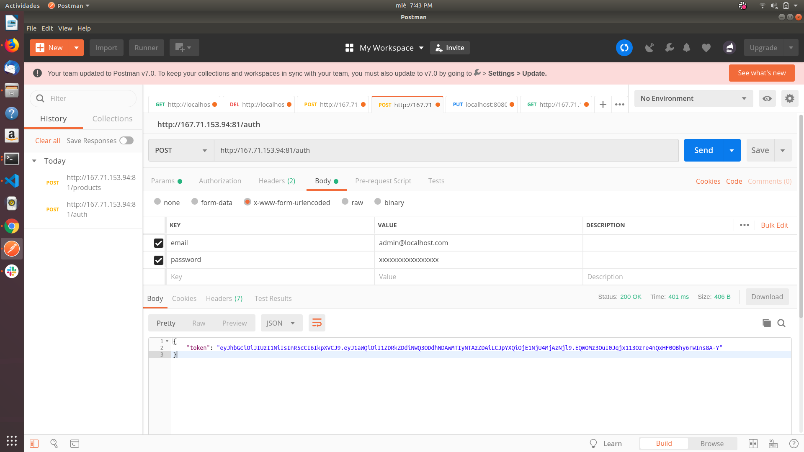
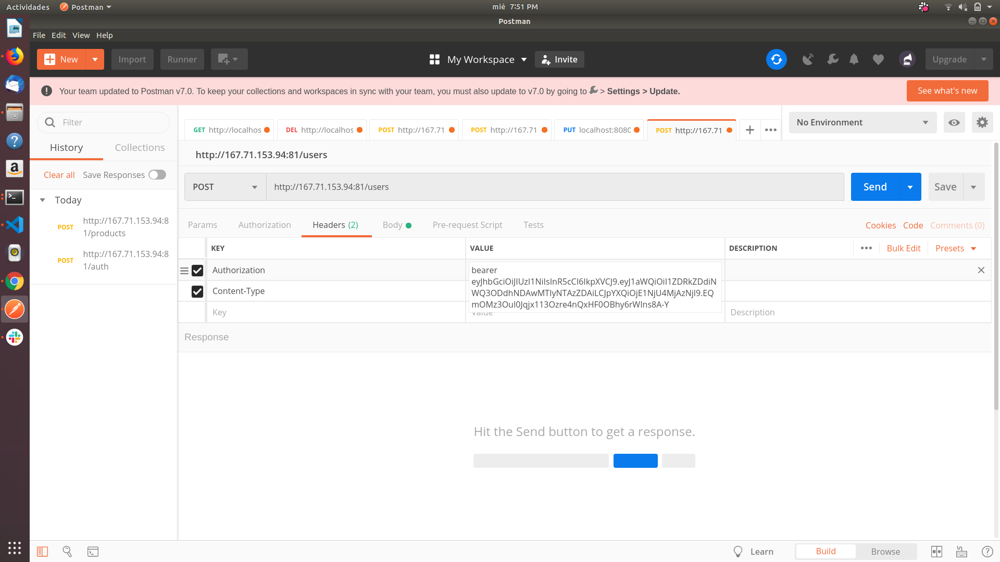
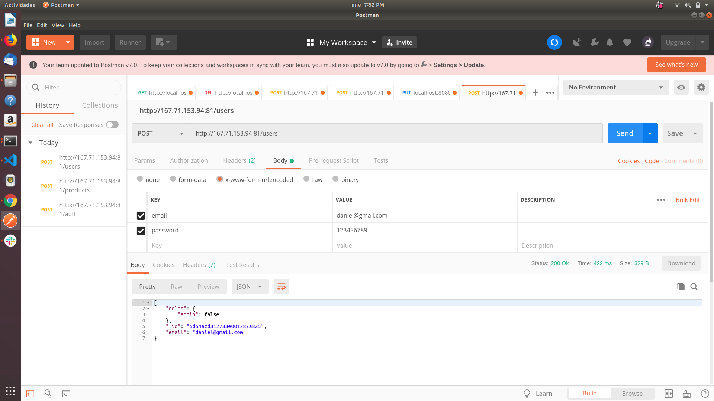
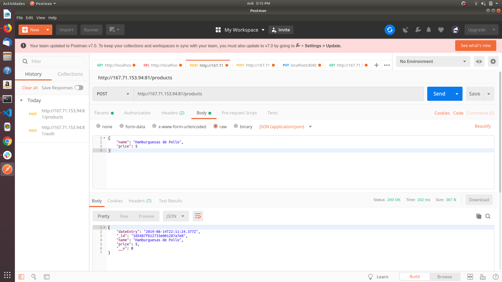
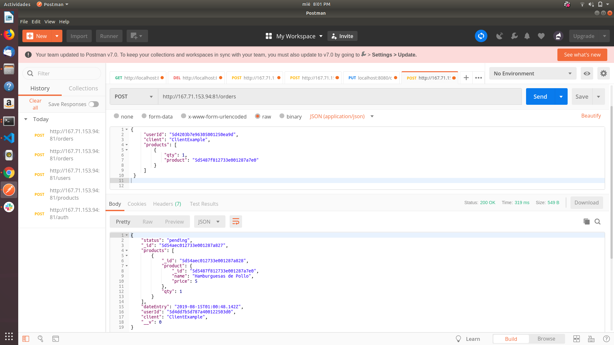

# Burger Queen - API con Node.js

Un pequeño restaurante de hamburguesas, que está creciendo, necesita un sistema a través del cual puedan tomar pedidos usando una tablet, y enviarlos a la cocina para que se preparen ordenada y eficientemente.

Este proyecto tiene dos áreas: interfaz (cliente) y API (servidor).

Nuestra clienta nos ha solicitado desarrollar la API que se debe integra con la interfaz, que otro equipo de desarrolladoras está trabajando simultáneamente

Para desarrollar la API rest utilizamos Node js y Express, lo complementamos con un motor de base de datos MongoDB. Utilizamos la librería Mongoose para poder conectarnos a la base de datos.

Se desarrollaron cuatro módulos(Auth, Users, Products, Orders) de acuerdo a lo solicitado en la documentaciónlink a la documentación,la cuál especifica el comportamiento esperado de la API que expondremos por HTTP.

## 1. API

Para generar las solicitudes debemos especificar el protocolo de red, en los siguientes ejemplos usaremos `https`, el IP de nuestra maquina de prueba será `167.71.153.94`, el puerto por defecto será `81`, a esto le añadiremos una ruta para especificar la petición (auth, users, products, orders).

Según lo establecido por la [documentación](https://laboratoria.github.io/burger-queen-api/) entregada por nuestra clienta, la API debe exponer los siguientes endpoints:

### 1.1 

    GET /

### 1.2 /auth

    POST /auth

A continuación mostraremos la autenticación del administrador (por razones de seguridad no mostraremos la contraseña del mismo) cabe precisar que para esta petición no necesitamos introducir datos en `headers`. El administrador a partir de la respuesta : `token` puede leer, crear, editar o eliminar otros usuarios, productos u órdenes.

### 1.3 /users

    GET /users
    GET /users/:uid
    POST /users
    PUT /users/:uid
    DELETE /users/:uid

Para esta petición necesitamos una autorización: `token` que se introducirá en el `headers` tal como se muestra en la siguiente imagen:

A continuación insertaremos los datos de un usuario ejemplo: 

### 1.4 /products

    GET /products
    GET /products/:productid
    POST /products
    PUT /products/:productid
    DELETE /products/:productid

La siguiente imagen ejemplifica una petición con el método POST para crear un nuevo producto en la base de datos.

### 1.5 /orders

    GET /orders
    GET /orders/:orderid
    POST /orders
    PUT /orders/:orderid
    DELETE /orders/:
    
Ahora crearemos una nueva orden del producto anteriormente mostrado, al igual que en los  ejemplos anteriores se introducirá un `token`, y los datos respectivos en el `body`:

